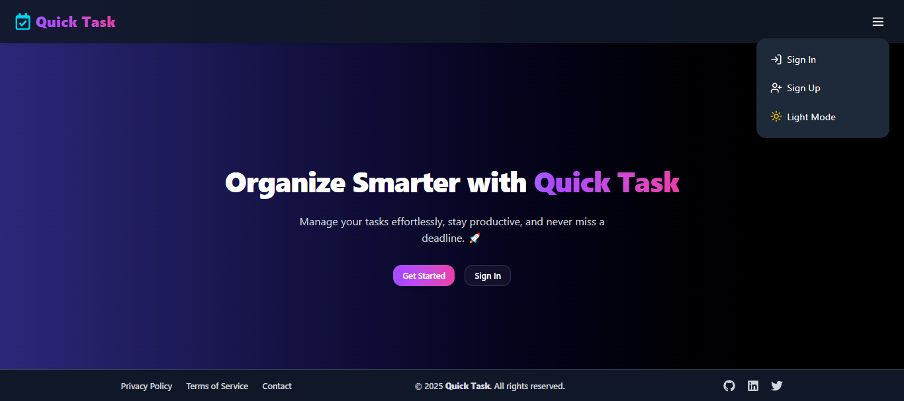
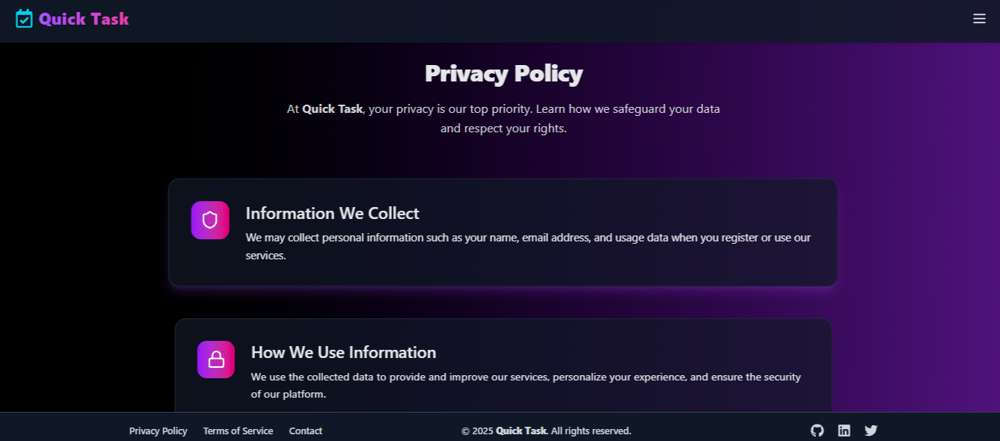
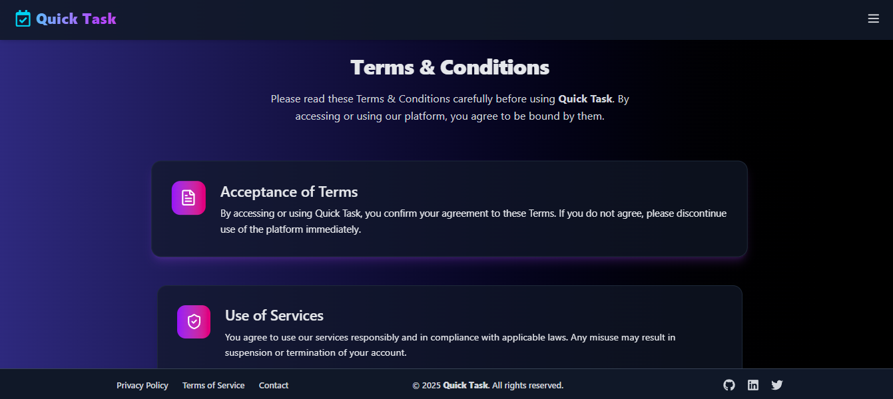

# 🚀 QuickTask -  Modern Project Management App  


A full-stack **Kanban-based project management application** built with Next.js and Supabase, designed to help teams stay organized and productive. QuickTask provides a seamless experience with authentication, dashboards, project/task management, and progress tracking — all with support for dark mode & light mode.

---

## ✨ Features  

### 🔐 Authentication  
- Sign in & sign up with **Email, Google, and GitHub**  
- Secure authentication powered by **Supabase**  
- Session persistence with auto-refresh  

### 📊 Dashboard  
- **Kanban Board** with drag-and-drop task management  
- **Customizable columns/stages** (Yet to Start, In Progress, Completed)  
- **Progress Chart** with real-time updates  
- **CRUD operations** for tasks and projects  
- Assign **priority levels** for tasks within each project  

### 👤 User Profile  
- Add/edit personal details: **Name, Date of Birth**  
- Upload and update **profile photo**  
- Track personal activity and project participation  

### 🎨 UI/UX  
- **Dark Mode & Light Mode** toggle across all pages  
- Responsive design for **desktop and mobile**  
- Clean, modern interface with smooth animations  

### 📑 Additional Pages  
- **Home Page** with app overview  
- **Privacy Policy** page  
- **Terms & Conditions** page  
- **Contact Page** with form integration  

---

## 🖼️ Screenshots  

| Feature              | Screenshot |
|-----------------------|------------|
| 🏠 Home Page         |  |
| 🔑 Sign In           |  |
| 🔐 Sign Up           |  |
| 📊 Dashboard         |  |
| 👤 Profile Page      |  |
| 📑 Privacy Policy    |  |
| 📈 Terms & Conditions|  |


---

## 🚀 Tech Stack  

### 🎨 Frontend
- **Next.js 14** – Modern React framework  
- **TypeScript** – Strongly typed development  
- **Tailwind CSS + ShadCN UI** – Styling & UI components  
- **Framer Motion** – Smooth animations  
- **Recharts** – Progress tracking charts

### 🖥 Backend
- **Supabase** – Database, authentication & storage  
- **PostgreSQL** – Underlying database (via Supabase)  

### ⚡ Other
- **Vercel** – Deployment & hosting  
- **Lucide Icons** – Modern icons  

---

## 📋 Prerequisites  

- **Node.js** (v18 or higher)  
- **Supabase Account** (for Auth + DB)  
- **Git** (for version control)  

---

## ⚙️ Installation  

1.**Clone the Repository**  
```bash
git clone https://github.com/yourusername/quicktask.git
cd quicktask
```
2.**Install Dependencies**
```bash
npm install
```
3.**Configure Environment Variables**
Create a .env.local file in the root directory:
```bash
NEXT_PUBLIC_SUPABASE_URL=your_supabase_url
NEXT_PUBLIC_SUPABASE_ANON_KEY=your_supabase_anon_key
```
4.**Run the Development Server**
```bash
npm run dev
```
---

## 📱 Usage

- 🔑 **Sign Up / Login** — via Email, Google, or GitHub
- 🗂 **Dashboard** - Access Kanban Board + Progress Chart
- 🛠 **Manage Projects** — Create, edit, and delete projects
- ✅ **Tasks** — Add tasks with priorities, drag & drop across stages
- 📊 **Track Progress** — Real-time chart updates
- 👤 **Profile** — Update name, DOB, and upload profile picture
- 🌙 **Theme** — Switch between Dark / Light mode

---

## 🔐 Security Features

- ✅ Secure authentication via Supabase
- 🔄 Session persistence & refresh tokens

---

## 🌐 Deployment

QuickTask is deployed on Vercel:
👉 https://quicktask-nu.vercel.app

----
